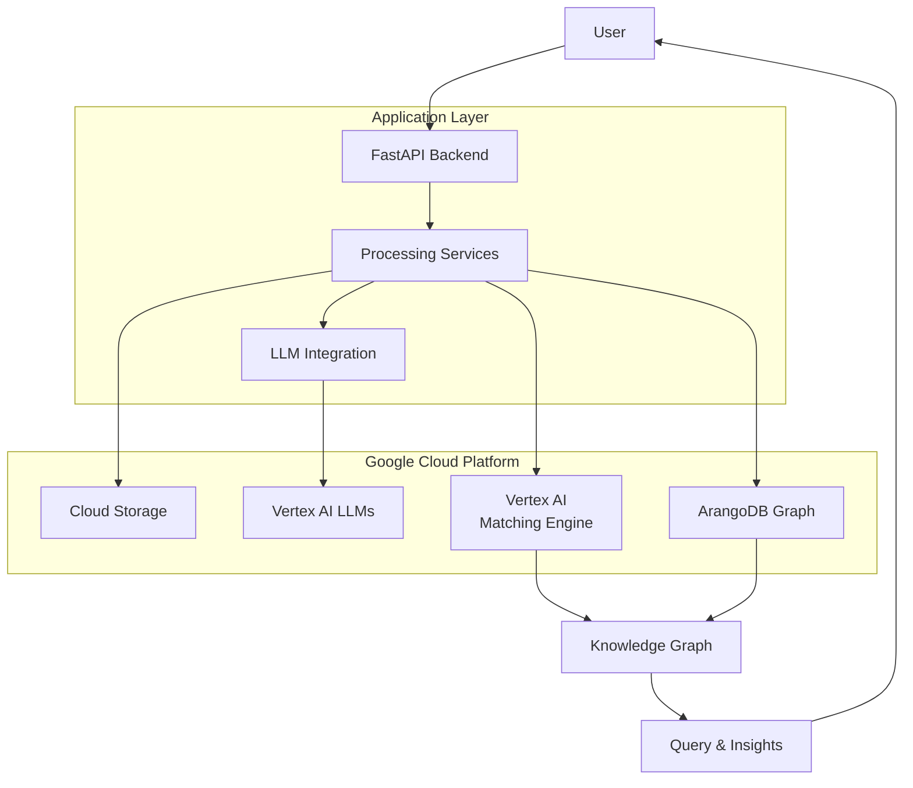

# eDiscovery Knowledge Graph Engine 


## Overview
A deep-tech SaaS platform that uses automated knowledge graphs to revolutionize the electronic discovery (eDiscovery) process for legal and compliance investigations.

Turn your corpus of text(pdf, emails, chats, etc,,) into a queryable knowledge base. This tool processes  documents, uses Large Language Models (LLMs) to extract structured knowledge (entities & relationships), builds a dynamic Knowledge Graph, and enables semantic querying over your entire corpus.

 ## ✨ Features

    📄 Document Processing: Upload and manage documents (PDF, emails, etc.).

    🧠 AI-Powered Extraction: Leverage LLMs to identify key entities (e.g., people, dates, organizations, monetary figures) and their relationships.

    🕸️ Knowledge Graph Construction: Automatically infers and visualizes a semantic relationships.

    ❓ Intelligent Q&A and Discovery: Ask complex, natural language questions and retrive the "smoking gun".

    ☁️ Cloud-Native & Scalable: Designed for the cloud (GCP) with a FastAPI backend for high performance.

## Doker RUN 

```bash
git clone https://github.com/shrisha-rao/kg_app
cd kg_app

# Uses Emulators so we can avoid setting up GCP 

docker compose build web
docker compose up web

```
### TEST APP wih API access 
go to : http://0.0.0.0:8000/docs#/


## Architecture



## Current Implementation Status

### ✅ Completed Components

#### Core Infrastructure
- **FastAPI Application** with modular architecture
- **Configuration Management** with environment variables
- **Dockerization** with multi-stage builds
- **Terraform Infrastructure** for GCP resources
- **Multi-environment setup** (dev, stage, prod)

#### Authentication & User Management
- **Firebase Authentication** integration
- **User model** with Firestore storage
- **Protected API endpoints** with JWT tokens
- **Role-based access control**

#### File Processing Pipeline
- **PDF text extraction** with PyMuPDF
- **Modular embedding generation** system
- **Abstract base classes** for easy implementation swapping
- **Local embedding generator** using Sentence Transformers
- **Vertex AI embedding generator** for cloud-based embeddings

#### Services Architecture
- **Abstract service interfaces** for storage, vector DB, graph DB, and LLM
- **GCP Cloud Storage** implementation for file storage
- **Modular design** for easy component replacement

### 🚧 Partially Implemented

#### Vector Database Integration
- **Vertex AI Matching Engine service** partially implemented
- **Base interface** defined for vector operations
- **Metadata storage solution** designed but not fully implemented

#### Knowledge Graph Storage
- **ArangoDB interface** defined but not implemented
- **Graph operations** schema designed

#### Query Processing
- **LLM interface** defined but not implemented
- **Query orchestration** logic outlined

### 📋 Pending Implementation

#### Complete Vector DB Service
- **Metadata integration** with Firestore
- **Batch operations** with rate limiting
- **Error handling** and retry logic
- **Monitoring** and performance tracking

#### Graph Database Implementation
- **ArangoDB integration** for knowledge graph
- **Entity-relationship storage**
- **Graph traversal** operations

#### LLM Integration
- **Vertex AI LLM** implementation
- **Prompt engineering** for research questions
- **Response formatting** and citation

#### Advanced Features
- **Compliance filtering** for public/private data
- **Advanced caching** strategies
- **Data backup** and migration tools
- **Admin dashboard** for management

## Project Structure

```
research-kg-app/
├── docker/                          # Docker configuration
│   ├── Dockerfile                   # Production Dockerfile
│   ├── Dockerfile.dev               # Development Dockerfile
│   └── docker-compose.yml           # Local development setup
├── infrastructure/                  # Terraform configurations
│   ├── modules/                     # Reusable Terraform modules
│   │   ├── gke/                     # GKE cluster module
│   │   ├── cloud-run/               # Cloud Run service module
│   │   ├── vertex-ai/               # Vertex AI resources module
│   │   └── networking/              # Networking resources module
│   ├── dev/                         # Development environment
│   │   ├── main.tf                  # Main configuration
│   │   ├── variables.tf             # Environment variables
│   │   ├── outputs.tf               # Output values
│   │   └── terraform.tfvars         # Variable values
│   ├── stage/                       # Staging environment
│   │   └── ... (same as dev)
│   └── prod/                        # Production environment
│       └── ... (same as dev)
├── src/                             # Application source code
│   ├── main.py                      # FastAPI application entry point
│   ├── config.py                    # Configuration management
│   ├── models/                      # Pydantic models
│   │   ├── user.py                  # User models ✅
│   │   ├── paper.py                 # Paper models ✅
│   │   └── query.py                 # Query models ✅
│   ├── services/                    # Core services
│   │   ├── storage/                 # Storage abstractions
│   │   │   ├── base.py              # Abstract base class ✅
│   │   │   └── gcp_cloud_storage.py # GCP implementation ✅
│   │   ├── vector_db/               # Vector database abstractions
│   │   │   ├── base.py              # Abstract base class ✅
│   │   │   └── vertex_ai_matching_engine.py # Partial implementation 🚧
│   │   │   └── vertex_ai_matching_engine_with_metadata.py #Enhanced Matching Engine service that handles metadata storage.
│   │   ├── graph_db/                # Graph database abstractions
│   │   │   ├── base.py              # Abstract base class ✅
│   │   │   └── arangodb.py          # Not implemented 📋
│   │   ├── llm/                     # LLM service abstractions
│   │   │   ├── base.py              # Abstract base class ✅
│   │   │   └── vertex_ai.py         # Not implemented 📋
│   │   ├── file_processing.py       # File processing orchestration ✅
│   │   ├── query_processing.py      # Query processing orchestration 🚧
│   │   └── compliance.py            # Compliance filtering 📋
│   ├── processing/                  # Processing modules
│   │   ├── embedding/               # Embedding generation module
│   │   │   ├── __init__.py          # Package initialization ✅
│   │   │   ├── base.py              # Abstract base class ✅
│   │   │   ├── local.py             # Local implementation ✅
│   │   │   ├── vertex_ai.py         # Vertex AI implementation ✅
│   │   │   └── utils.py             # Common utilities ✅
│   │   ├── pdf_extractor.py         # PDF text extraction ✅
│   │   ├── ner_extractor.py         # NER and relation extraction 📋
│   │   └── embedding_generator.py   # Legacy file (replaced) ✅
│   ├── api/                         # API endpoints
│   │   ├── upload.py                # File upload endpoints ✅
│   │   ├── query.py                 # Query endpoints 🚧
│   │   ├── papers.py                # Paper management endpoints ✅
│   │   └── auth.py                  # Authentication endpoints ✅
│   ├── utils/                       # Utility functions
│   │   ├── cache.py                 # Redis cache wrapper ✅
│   │   ├── auth.py                  # Authentication utilities ✅
│   │   └── logging.py               # Logging configuration ✅
│   └── scripts/                     # Maintenance scripts
│       ├── init_graph_db.py         # Initialize graph database 📋
│       ├── backup_vectors.py        # Backup vector data 📋
│       └── migrate_data.py          # Data migration utilities 📋
├── tests/                           # Test suite
│   ├── unit/                        # Unit tests
│   │   ├── test_services.py         # Service tests 📋
│   │   ├── test_processing.py       # Processing tests 📋
│   │   └── test_api.py              # API tests 📋
│   ├── integration/                 # Integration tests
│   │   ├── test_storage_integration.py 📋
│   │   ├── test_vector_db_integration.py 📋
│   │   └── test_graph_db_integration.py 📋
│   ├── conftest.py                  # Test fixtures 📋
│   └── pytest.ini                   # Pytest configuration 📋
├── docs/                            # Documentation
│   ├── architecture.md              # Architecture decisions ✅
│   ├── api.md                       # API documentation 🚧
│   ├── deployment.md                # Deployment guide 🚧
│   └── development.md               # Development setup 🚧
├── scripts/                         # Deployment and utility scripts
│   ├── deploy.sh                    # Deployment script 📋
│   ├── build.sh                     # Docker build script 📋
│   ├── test.sh                      # Test runner 📋
│   └── terraform-apply.sh           # Terraform execution wrapper 📋
├── .github/                         # GitHub workflows
│   └── workflows/
│       ├── ci.yml                   # Continuous integration 📋
│       ├── cd-dev.yml               # Development deployment 📋
│       ├── cd-stage.yml             # Staging deployment 📋
│       └── cd-prod.yml              # Production deployment 📋
├── .dockerignore                    # Docker ignore file ✅
├── .gitignore                       # Git ignore file ✅
├── .env.example                     # Environment variables template ✅
├── requirements.txt                 # Production dependencies ✅
├── requirements-dev.txt             # Development dependencies ✅
├── Dockerfile                       # Main Dockerfile ✅
├── docker-compose.yml               # Main compose file ✅
├── terraform.tfvars.example         # Terraform variables template ✅
└── README.md                        # Project overview ✅
```

## Getting Started

### Prerequisites
- Python 3.9+
- Docker
- Terraform
- Google Cloud SDK
- GCP account with billing enabled

### Local Development
1. Clone the repository
2. Set up environment variables: `cp .env.example .env`
3. Install dependencies: `pip install -r requirements.txt -r requirements-dev.txt`
4. Run the application: `uvicorn src.main:app --reload`

### Deployment
1. Initialize Terraform: `cd infrastructure/dev && terraform init`
2. Plan deployment: `terraform plan`
3. Apply configuration: `terraform apply`
4. Build and deploy Docker image

## Configuration

### Environment Variables
- `GCP_PROJECT_ID`: Your GCP project ID
- `GCP_REGION`: GCP region for deployment
- `EMBEDDING_TYPE`: "local" or "vertex_ai"
- `LOCAL_EMBEDDING_MODEL`: Sentence Transformers model name
- `VERTEX_AI_EMBEDDING_MODEL`: Vertex AI model name
- `VERTEX_AI_INDEX_ID`: Matching Engine index ID
- `VERTEX_AI_INDEX_ENDPOINT_ID`: Matching Engine endpoint ID

## API Endpoints

### Authentication
- `POST /auth/signup`: Create a new user account
- `POST /auth/login`: Login with Firebase token
- `GET /auth/me`: Get current user information
- `PUT /auth/me`: Update user information
- `POST /auth/refresh`: Refresh authentication token
- `POST /auth/logout`: Logout endpoint

### Papers Management
- `POST /papers/upload`: Upload a pdf
- `GET /papers/`: Get user's papers
- `GET /papers/{paper_id}`: Get paper details
- `PUT /papers/{paper_id}`: Update paper metadata
- `DELETE /papers/{paper_id}`: Delete a paper

### Query Interface
- `POST /query`: Query the knowledge graph

## Next Steps

1. Complete Vertex AI Matching Engine implementation
2. Implement ArangoDB integration for knowledge graph
3. Add Vertex AI LLM integration for question answering
4. Implement compliance filtering for public/private data
5. Add comprehensive test suite
6. Set up CI/CD pipelines
7. Implement monitoring and alerting

## Contributing

1. Fork the repository
2. Create a feature branch: `git checkout -b feature/amazing-feature`
3. Commit changes: `git commit -m 'Add amazing feature'`
4. Push to branch: `git push origin feature/amazing-feature`
5. Open a pull request

## License


## Support

For support, please open an issue in the GitHub repository or contact the development team.
